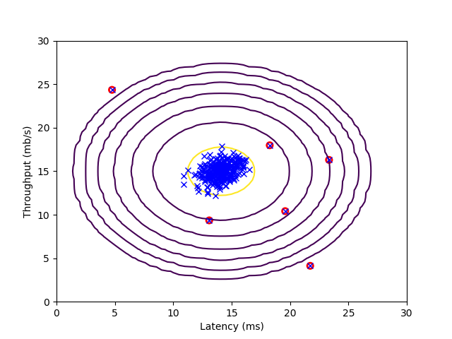

# Anomaly Detection

**Example**

1. Fraud detection:
    - $x^{(i)}=$features of user $i$'s activities
    - Model $p(x)$ from data
    - Identify unusual users by checking which have $p(x) < \epsilon$

2. Manufacturing
	- Monitoring computers in a data center

## Gaussian distribution

$$x^{(i)} \sim \mathbb N(\mu, \sigma^2)$$

### parameter estimation

**Dataset:** $\{ x^{(1)},x^{(2)},\dots,x^{(m)} \} \quad x^{(i)} \in \mathbb R$

we want to know $\mu, \sigma^2$

$$\mu = \frac{1}{m}\sum_{i=1}^m x^{(i)} \\
\sigma^2=\frac{1}{m}\sum_{i=1}^m (x^{(i)}-\mu)^2$$

## Algorithm

1. Choose features $x_i$ that you think might be indicative of anomalous examples.
2. Fit examples $\mu_1,\dots,\mu_n,\sigma_1^2,\dots,\sigma_n^2$
$$\begin{align}
& \mu_j = \frac{1}{m}\sum_{i=1}^m x_j^{(i)} \\
& \sigma_j^2=\frac{1}{m}\sum_{i=1}^m (x_j^{(i)}-\mu_j)^2
\end{align}$$

3. Given new example $x$, compute $p(x)$:
$$p(x)=\prod_{j=1}^np(x_j;\mu_j,\sigma_j^2)=\prod_{j=1}^n\frac{1}{\sqrt{2\pi}\sigma_j}\exp(-\frac{(x_j-\mu_j)^2}{2\sigma_j^2})$$

Anomaly if $p(x) < \epsilon$

## Developing and evaluating anomaly detection system

### Aircraft engines motivating example

- 10000 good(normal) engines
- 20    flawed engines

- Always
	- Training set:6000 good engines
	- CV:2000 good engines($y=0$),10 anomalous($y=1$)
	- Test:2000 good engines($y=0$),10 anomalous($y=1$)

- Alternative:
	- Training set:6000 good engines
	- CV:4000 good engines($y=0$),10 anomalous($y=1$)
	- Test:4000 good engines($y=0$),10 anomalous($y=1$)


### Algorithm evaluation

- Fit model $p(x)$ on training set $\{ x^{(1)},\dots,x^{(m)} \}$
- On a cross validation/test example $x$, predict
$$y = \begin{cases}
1 & \mbox{if }p(x) < \epsilon \mbox{(anomaly)}\\
0 & \mbox{if }p(x) \geq \epsilon \mbox{(normal)}
\end{cases}$$

- Possible evaluation metrics:
	- True positive, false positive, false negative, true negative
	- Precision/Recall
	- $F_1$ score

- Can alse use cross validation set to choose parameter $\epsilon$

## Anomaly detection vs. supervised learning

| Anomaly detection | Supervised learning |
|--------|--------|
|Very small number of positive examples($y=1$).(0-20 is common)<br>Large number of negative ($y=0$) examples.|Large number of positive and negative examples.|
|Many different "types" of anomalies. Hard for any algorithm to learn from positive examples what the anomalies look like; future anomalies may look nothing like any of the anomalous examples we've seen so far.|Enough positive examples for algorithm to get a sense of what positive examples are like, future positive examples likely to be similar to ones in training set.|
|Fraud detection<br>Manufacturing(e.g. aircraft engines)<br>Monitoring machines in a data center|Email spam classification<br>Weather prediction<br>Cancer classification|

## Choosing what features to use

- we always do something to make our datas more Gaussian: like $x_1 \leftarrow \log(x_1)$

### Error analysis for anomaly detection

Want:
- $p(x)$ large for normal examples $x$.
- $p(x)$ small for anomalous examples $x$.

Most common problem:
- $p(x)$ is comparable (say, both large) for normal and anomalous examples.

Now:
- we can create some new features

## Multivariate Gaussian distribution

- Parameters: $\mu \in \mathbb R^n, \Sigma \in \mathbb R^{n \times n}$

**Parameter fitting:**

- Given training set: $\{ x^{(1)},x^{(2)},\dots,x^{(m)} \}$

$$\mu=\frac{1}{m}\sum_{i=1}^m x^{(i)} \quad \Sigma=\frac{1}{m}\sum_{i=1}^m(x^{(i)}-\mu)(x^{(i)}-\mu)^T$$

**Given a new example $x$, compute:**

$$p(x;\mu,\Sigma)=\frac{1}{(2\pi)^{\frac{n}{2}}|\Sigma|^{\frac{1}{2}}} \exp \left (-\frac{1}{2}( x - \mu)^T\Sigma^{-1}(x-\mu) \right )$$

**Flag an anomaly if ** $p(x) < \epsilon$

### Relationship to original model

**Original model:** $p(x)=p(x_1;\mu_1,\sigma_1^2) \times p(x_2;\mu_2,\sigma_2^2) \times \cdots \times p(x_n;\mu_n,\sigma_n^2)$

**Corresponds to multivariate Gaussian**

$$p(x;\mu,\Sigma)=\frac{1}{(2\pi)^{\frac{n}{2}}|\Sigma|^{\frac{1}{2}}} \exp \left (-\frac{1}{2}( x - \mu)^T\Sigma^{-1}(x-\mu) \right )$$

**where**

$$\Sigma=\begin{bmatrix}
\sigma_1^2 & \ & \ & \ \\
\ & \sigma_2^2 & \ & \ \\
\ & \ & \ddots & \ \\
\ & \ & \ & \sigma_n^2
\end{bmatrix}$$

### Original model vs. Multivariate Gaussian

| Original model | Multivariate Gaussian |
|--------|--------|
|Manually create features to capture anomalies where $x_1,x_2$ take unusual combinations of values.|Automatically captures correlations between features|
|Computationally cheaper(alternatively, scales better to large $n$)|Computationally more expensive|
|Ok even if $m$(training set size) is small|Must have $m > n$, or else $\Sigma$ is non-invertible|

## Exercise

- 本次实验包括：可视化异常监测结果，以及应用异常监测于一个小数据集。

**anomaly_detection.py**

``` python
# -*- coding: utf-8 -*-
"""
Created on Wed Aug  1 09:59:30 2018

@author: 周宝航
"""

import numpy as np
import numpy.linalg as la


class AnomalyDetector(object):
    
    def __init__(self):
        pass
    
    def estimateGaussian(self, X):
        m, n = X.shape
        mu = np.zeros([n, 1])
        sigma2 = np.zeros([n, 1])
        for i in range(n):
            mu[i] = np.mean(X[:, i])
            sigma2[i] = np.mean((X[:, i] - mu[i])**2)
        return mu,sigma2
    
    def multivariateGaussian(self, X, mu, sigma2):
        k = len(mu)
        sigma2 = np.diag(sigma2.flatten())
        X = X - mu.T
        p = (2 * np.pi) ** (- k / 2) * la.det(sigma2) ** (- 0.5) * \
            np.exp(-0.5 * np.sum(X.dot(la.pinv(sigma2)) * X, 1))
        return p.reshape([-1, 1])
    
    def selectThreshold(self, yval, pval):
        bestEpsilon = 0
        bestF1 = 0
        F1 = 0
        maxPval, minPval = max(pval), min(pval)
        stepsize = (maxPval - minPval) / 1000
        for epsilon in np.arange(minPval, maxPval, stepsize):
            predictions = pval < epsilon
            tp = np.sum((predictions == 1) & (yval == 1))
            fn = np.sum((predictions == 0) & (yval == 1))
            fp = np.sum((predictions == 1) & (yval == 0))
            prec = tp / (tp + fp)
            rec = tp / (tp + fn)
            F1 = 2 * prec * rec / (prec + rec)
            if F1 > bestF1:
                bestF1 = F1
                bestEpsilon = epsilon
        return bestEpsilon,bestF1
```

**main.py**

``` python
# -*- coding: utf-8 -*-
"""
Created on Wed Aug  1 11:02:43 2018

@author: 周宝航
"""

from anomaly_detect import AnomalyDetector
import matplotlib.pyplot as plt
import scipy.io as sio
import numpy as np

# ================== Load Example Dataset  ===================
data = sio.loadmat('data\\ex8data1.mat')

X = data['X']

fig = plt.figure()
ax = fig.add_subplot(1,1,1)

ax.plot(X[:, 0], X[:, 1], 'bx')
ax.axis([0, 30, 0, 30])
ax.set_xlabel('Latency (ms)')
ax.set_ylabel('Throughput (mb/s)')

# ================== Estimate the dataset statistics ===================
def visualizeFit(anomalyDetector, X, mu, sigma2):
    rg = np.arange(0,35.5,0.5)
    X1, X2 = np.meshgrid(rg, rg)
    Z = anomalyDetector.multivariateGaussian(np.c_[X1.reshape([-1, 1]), X2.reshape([-1, 1])], mu, sigma2)
    Z = Z.reshape(X1.shape)
    
    plt.contour(X1, X2, Z, 10**np.arange(-20,0,3,dtype=float).T)

anomalyDetector = AnomalyDetector()

mu, sigma2 = anomalyDetector.estimateGaussian(X)

p = anomalyDetector.multivariateGaussian(X, mu, sigma2)

visualizeFit(anomalyDetector, X, mu, sigma2)

# ================== Find Outliers ===================
Xval = data['Xval']
yval = data['yval']

pval = anomalyDetector.multivariateGaussian(Xval, mu, sigma2)

epsilon, F1 = anomalyDetector.selectThreshold(yval, pval)

outliers = np.where(p < epsilon)[0]

ax.scatter(X[outliers, 0], X[outliers, 1], marker='o', color='', edgecolors='r', linewidth=2)
plt.show()
# ================== Multidimensional Outliers ===================
data = sio.loadmat('data\\ex8data2.mat')
X = data['X']
Xval = data['Xval']
yval = data['yval']

mu, sigma2 = anomalyDetector.estimateGaussian(X)

p = anomalyDetector.multivariateGaussian(X, mu, sigma2)

pval = anomalyDetector.multivariateGaussian(Xval, mu, sigma2)

epsilon, F1 = anomalyDetector.selectThreshold(yval, pval)

print('Best epsilon found using cross-validation: %e\n' % epsilon);
print('Best F1 on Cross Validation Set:  %f\n' % F1);
print('   (you should see a value epsilon of about 1.38e-18)\n');
print('   (you should see a Best F1 value of 0.615385)\n');
print('# Outliers found: %d\n\n' % np.sum(p < epsilon));
```

**result**

- 下图中，红圈标记的数据点为异常数据，而位于黄色椭圆圈附近的为正常数据。



