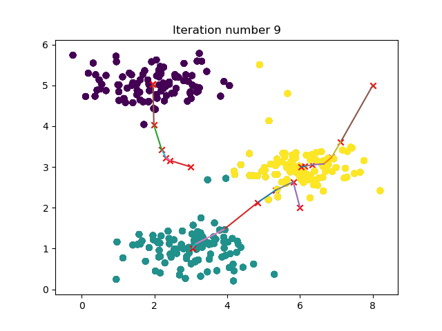
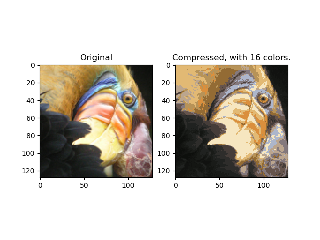

# K 均值

## Algorithm

**Input**

- $K$(number of clusters)
- Training set $\{ x^{(1)},x^{(2)}, \dots, x^{(m)} \}$
    - $x^{(i)} \in \mathbb R^n$

**Steps**

1. Randomly initialize $K$ cluster centroids $\mu_1, \mu_2, \dots, \mu_K \in \mathbb R^n$

2. 

$$\begin{align}
\mbox{Repeat } & \{ \\
& \mbox{for } i=1 \ \mbox{to } m \\
& \quad c^{(i)} := \mbox{index (from 1 to K) of cluster centroid closet to } x^{(i)} \\
& \mbox{for } i=1 \ \mbox{to } K \\
& \quad \mu_k := \mbox{average (mean) of points assigned to cluster } k \\
& \}
\end{align}$$

## Optimization objective

- $c^{(i)} = \mbox{index of cluster } (1,2,\dots,K) \mbox{to witch example } x^{(i)} \mbox{ is currently assigned}$
- $\mu_k = \mbox{cluster centroid } k (\mu_k \in \mathbb R^n)$
- $\mu_{c^{(i)}} = \mbox{cluter centroid of cluter to witch example } x^{(i)} \mbox{ has been assigned}$

**Objective**

$$J(c^{(1)},\dots,c^{(m)},\mu_1,\dots,\mu_K)=\frac{1}{m}\sum_{i=1}^m \left \| x^{(i)}-\mu_{c^{(i)}} \right \|^2 \\
\mathop{\min}_{\begin{align}c^{(1)},\dots,c^{(m)}\\ \mu_1,\dots,\mu_K \end{align}} J(c^{(1)},\dots,c^{(m)},\mu_1,\dots,\mu_K)
$$

## Random Initialization

- $\mbox{Should have } K < m$
- $\mbox{Randomly pick } K \mbox{ training examples}$
- $\mbox{Set } \mu_1,\dots,\mu_K \mbox{ equal to these } K \mbox{ examples}$

$$\begin{align}
\mbox{For i=1 } & \mbox{to 100 (or other)} \{ \\
& \mbox{Randomly initialize K-means}\\
& \mbox{Run K-means. Get } c^{(1)},\dots,c^{(i)},\mu_1,\dots,\mu_K\\
& \mbox{Compute cost function(distortion)}\\
& \quad J(c^{(1)},\dots,c^{(m)},\mu_1,\dots,\mu_K)\\
& \}
\end{align}$$

- $\mbox{Pick clustering that gave lowest cost } J(c^{(1)},\dots,c^{(m)},\mu_1,\dots,\mu_K)$

## Choosing the number of clusters

**Elbow method:**

1. $\mbox{Choose different number of clusters like } (K=1,2,\dots,8)$

2. $\mbox{Compute the cost } J(c^{(1)},\dots,c^{(m)},\mu_1,\dots,\mu_K) \mbox{ on different K from the step 1}$

3. $\mbox{Plot (K, J) and we can find a K that the distortion goes down rapidly before it.}$

## Exercise

- 实验部分主要有：kmeans训练动态图示、图片压缩

**k_means.py**
``` python
# -*- coding: utf-8 -*-
"""
Created on Mon Jul 30 09:46:20 2018

@author: 周宝航
"""

import numpy as np
import numpy.linalg as la
import matplotlib.pyplot as plt

class KMeans(object):
    
    def __init__(self, K, num_itres):
        # cluster numbers
        self.K = K
        # iteration numbers
        self.num_itres = num_itres
    
    def initCentroids(self, X):
        m, n = X.shape
        rd = np.random.randint(0, m, self.K)
        centroids = X[rd, :]
        return centroids
        
    def findClosestCentroids(self, X, centroids):
        m, n = X.shape
        idx = np.zeros([m, 1])
        for i in range(m):
            dis = [la.norm(X[i,:] - centroids[j,:]) for j in range(self.K)]
            idx[i] = np.where(dis == np.min(dis))[0][0]
        return np.uint8(idx)
    
    def computeCentroids(self, X, idx):
        m, n = X.shape
        centroids = np.zeros([self.K, n])
        for i in range(self.K):
            index = (idx == i)
            counts = np.sum(index)
            centroids[i, :] = X.T.dot(index).T / counts
        return centroids
    
    def plotDataPoints(self, X, idx):
        self.ax.scatter(X[:, 0], X[:, 1], c = idx[:, 0])
    
    def plotProgresskMeans(self, X, centroids, previous, idx, no_i):
        self.plotDataPoints(X, idx)
        self.ax.scatter(centroids[:, 0].tolist(), centroids[:, 1].tolist(), c = 'r', marker = 'x')
        for i in range(self.K):
            data = np.r_[centroids[i, :].reshape([1,-1]), previous[i, :].reshape([1,-1])]
            self.ax.plot(data[:, 0], data[:, 1])
        self.ax.set_title('Iteration number {0}'.format(no_i))
    
    def train_model(self, X, centroids, plot_progress=False):
        m, n = X.shape
        self.centroids = centroids
        previous_centroids = self.centroids
        idx = np.zeros([m, 1])
        if plot_progress:
            fig = plt.figure()
            self.ax = fig.add_subplot(1,1,1)
        for i in range(self.num_itres):
            idx = self.findClosestCentroids(X, self.centroids)
            if plot_progress:
                self.plotProgresskMeans(X, self.centroids, previous_centroids, idx, i)
                previous_centroids = self.centroids
            self.centroids = self.computeCentroids(X, idx)
            plt.pause(0.01)
        if plot_progress:
            plt.show()
        return (self.centroids, idx)
```

**main.py**

``` python
# -*- coding: utf-8 -*-
"""
Created on Mon Jul 30 10:05:54 2018

@author: 周宝航
"""

from k_means import KMeans
import scipy.io as sio
import numpy as np
import matplotlib.pyplot as plt

# =================== K-Means Clustering ======================
data = sio.loadmat('data\\ex7data2.mat')

K = 3
num_iters = 10
X = data['X']
initial_centroids = np.matrix([[3,3],
                               [6,2],
                               [8,5]])

kmeans = KMeans(K, num_iters)

idx = kmeans.findClosestCentroids(X, initial_centroids)

kmeans.train_model(X, initial_centroids, True)

# ============= K-Means Clustering on Pixels ===============
data = sio.loadmat('data\\bird_small.mat')

A = data['A']

A = A / 255
m, n, _ = A.shape
X = A.reshape([-1, 3])

K = 16
num_iters = 10

kmeans = KMeans(K, num_iters)
initial_centroids = kmeans.initCentroids(X)
centroids, _ = kmeans.train_model(X, initial_centroids)

# ================= Image Compression ======================
idx = kmeans.findClosestCentroids(X, centroids)

X_recoverd = centroids[idx, :]

X_recoverd = X_recoverd.reshape([m, n, 3])

fig = plt.figure()

original = fig.add_subplot(1,2,1)
original.set_title('Original')
original.imshow(A)

compressed = fig.add_subplot(1,2,2)
compressed.set_title('Compressed, with {0} colors.'.format(K))
compressed.imshow(X_recoverd)

plt.show()
```

**结果**

