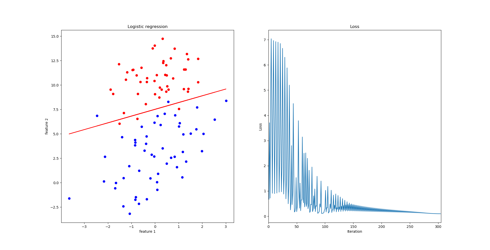

# Logistic Regression

## Classification

- Email : Spam/Not Spam?
- Online Transactions : Fraudulent(Yes/No)?
- Tumor : Malignant/Brnign?

$$y \in \{ 0,1 \}\\\begin{align}0&:"Negative \ Class"(e.g., benign \ tumor)\\1&:"Positive\  Class"(e.g.,malignant \ tumor)\end{align}$$

**So:** *Linear regression*'s $h_\theta(x)$ can be $> 1$ or $< 0$

**Logistic Regression:**$0 \le h_\theta(x)\le 1$

## Hypothesis Representation

- want $0 \le h_\theta(x)\le 1$

- original

$$h_\theta(x)=g(\theta^Tx)$$

- sigmoid function

$$g(z)=\frac{1}{1+e^{-z}}$$

- new

$$h_\theta(x)=\frac{1}{1+e^{-\theta^Tx}}$$


### Interpretation of Hyphothesis Output

$h_\theta(x)=$ estimated probability that $y=1$ on input $x$

**Example:** if $\begin{align}&x=\begin{bmatrix}x_0\\ x_1 \end{bmatrix}=\begin{bmatrix}1 \\ tumorSize \end{bmatrix}\\ & h_\theta(x)=0.7 \end{align}$

Tell patient that 70% chance of tumor being malignant

**Summarize:**

$$h_\theta(x)=P(y=1|x;\theta)$$

- "Probability that y = 1, given x, parameterized by $\theta$"

$$P(y=0|x;\theta)+P(y=1|x;\theta)=1$$

## Decision boundary

- 决策边界是假设函数的一个属性，它将平面分为两部分。其只与假设函数中的参数有关，因此不是数据集的属性。

**E.g.**

$$h_\theta(x)=g(\theta_0+\theta_1x_1+\theta_2x_2)$$

**and**

$$\theta=\begin{bmatrix}-3\\1\\1 \end{bmatrix}$$


We compute $\theta^Tx$ : get $-3+x_1+x_2$

So $x_1+x_2=3$ maps "$h_\theta(x)=0.5$"
Predict "$y=1$" if $-3+x_1+x_2 \ge 0$ 

## Cost function

**Training set:** $\{(x^{(1)},y^{(1)}),(x^{(2)},y^{(2)}),\dots,(x^{(m)},y^{(m)}) \}$

**m examples:** $x\in\begin{bmatrix}x_0\\ x_1\\ \cdots\\ x_n\end{bmatrix}\ \ \ x_0=1,y\in\{0,1\}$

$$h_\theta(x)=\frac{1}{1+e^{-\theta^Tx}}$$


**Redefine:**

$$J(\theta)=\frac{1}{m}\sum_{i=1}^mCost(h_\theta(x),y)$$

**Logistic regression cost function**

$$Cost(h_\theta(x),y)=\begin{cases}-\log(h_\theta(x)) &\mbox{if }y=1\\ -\log(1-h_\theta(x)) &\mbox{if } y=0 \end{cases}$$

- 两种情况合并

$$Cost(h_\theta(x),y)=-y\log(h_\theta(x))-(1-y)\log(1-h_\theta(x))$$

- 上式代入原成本函数

$$J(\theta)=-\frac{1}{m}\left[ \sum_{i=1}^m y^{(i)}\log h_\theta(x^{(i)}) + (1-y^{(i)}) \log(1-h_\theta(x^{(i)}))\right]$$


## Gradient Descent

Repeat {

$$\theta_j:=\theta_j-\alpha\sum_{i=1}^m(h_\theta(x^{(i)})-y^{(i)})x_j^{(i)}$$

}

**Code**

$$\theta=\begin{bmatrix}\theta_0\\\theta_1\\\vdots\\\theta_n \end{bmatrix}$$

*matlab*
$$function \ [jVal, gradient] = costFunction(theta)\\\begin{align}
&jval = [code\ to\ compute\ J(\theta)]\\
&gradient(1)\ = [code \ to \ compute \ \frac{\partial}{\partial\theta_0}J(\theta)]\\&gradient(2) \ = \ [code \ to \ compute \ \frac{\partial}{\partial\theta_1}J(\theta)]\\ &\vdots\\&gradient(n+1) \ = \ [code \ to \ compute \ \frac{\partial}{\partial\theta_n}J(\theta)]\end{align} $$


## Multiclass Classification

- Email foldering/tagging:Work, Friendly, Family, Hobby
- Medical diagrams:Not ill, Cold, Flu
- Weather:Sunny, Cloudy, Rain, Snow

### One versus rest

- 假设我们现在要分为三类：**T**,**S**,**C**

**流程**：
1. 先考查**T**这一类，将剩余的类全部看作一类。如此一来，又变为了Binary Classification问题。然后，使用Logistic Regression得到了一个$h_\theta^{(1)}(x)$.
2. 然后，按照上面的步骤，继续得到对**S**,**C**这两类的$h_\theta^{(2)}$与$h_\theta^{(3)}$.

**Summarize:**

Train a logistic regression classifier $h_\theta^{(i)}(x)$ for each class $i$ to predict the probability that $y=i$.

On a new input $x$, to make a prediction, pick the class $i$ that maximizes $\max_i h_\theta^{(i)}(x)$

## Exercise

- 当然又是实践一哈啦，附上代码和结果图

**logistic_regression.py**
``` python
# -*- coding: utf-8 -*-
"""
Created on Wed Jul 18 16:52:11 2018

@author: 周宝航
"""

import numpy as np
import matplotlib.pyplot as plt
import logging

class LogisticRegression(object):
    
    def __init__(self, num_iters=None, alpha=None, num_params=3):
        # iteration numbers
        self.num_iters = num_iters if num_iters else 1500
        # learning rate
        self.alpha = alpha if alpha else 0.01
        # parameters
        self.theta = np.zeros([num_params,1])
        # training datas
        self.data = None
        # logger
        self.logger = logging.getLogger()
        logging.basicConfig(format='%(asctime)s: %(levelname)s: %(message)s')
        logging.root.setLevel(level=logging.INFO)
        
    def read_data(self, file_path=None):
        if file_path:
            self.logger.info("reading the data from %s" % file_path)
            self.data = np.loadtxt(file_path)
            
    def save(self, path=None):
        if path:
            import pickle
            with open(path, "rb") as f:
                pickle.dump(self.theta, f)
                
    def load(self, path=None):
        if path:
            import pickle
            with open(path, "rb") as f:
                self.theta = pickle.load(f)
                
    def sigmoid(self, z):
        return 1 / (1 + np.exp(- z))
    
    def computeCost(self, X, y, theta):
        m = len(y)
        h = self.sigmoid(X.dot(theta))
        J = - (y.T.dot(np.log(h)) + (1.0 - y).T.dot(np.log(1.0 - h))) / m
        return np.sum(J)
    
    def gradientDescent(self, X, y):
        for i in range(self.num_iters):
            h = self.sigmoid(X.dot(self.theta))
            self.theta = self.theta - self.alpha * X.T.dot(h - y)
            J = self.computeCost(X, y, self.theta)
            yield J
    
    def train_model(self, file_path=None):
        self.read_data(file_path)
        self.logger.info("getting the feature values")
        x = self.data[:,:-1]
        self.logger.info("getting the object values")
        y = self.data[:,-1].reshape([-1, 1])
        # generate the feature matrix
        X = np.c_[np.ones([len(x), 1]), x]
        self.logger.info("start gradient descent")
        fig = plt.figure()
        ax_model = fig.add_subplot(1,2,1)
        for feature,tag in zip(x,y):
            color = 'or' if tag==0 else 'ob'
            ax_model.plot(feature[0], feature[1], color)
        ax_loss = fig.add_subplot(1,2,2)
        J_history = []
        for J in self.gradientDescent(X, y):
            J_history.append(J)
        ax_model.set_title('Logistic regression')
        ax_model.set_xlabel('feature 1')
        ax_model.set_ylabel('feature 2')
        tx = x[:,0]
        ty = (-self.theta[0, 0] - self.theta[1, 0] * tx) / self.theta[2, 0]
        ax_model.plot(tx, ty, color='r')

        ax_loss.set_title('Loss')
        ax_loss.set_xlabel('Iteration')
        ax_loss.set_ylabel('Loss')
        ax_loss.set_xlim(0,self.num_iters)
        ax_loss.plot(J_history)
        plt.show()
        self.logger.info("end")
```

**train_model.py**
``` python
# -*- coding: utf-8 -*-
"""
Created on Wed Jul 18 16:50:20 2018

@author: 周宝航
"""

import logging
import os.path
import sys
import argparse
from logistic_regression import LogisticRegression

if __name__ == '__main__':
    program = os.path.basename(sys.argv[0])
    
    parser = argparse.ArgumentParser(prog=program, description = 'train the model by linear regression')
    parser.add_argument("--in_path", "-i", required=True, help="train data path")
    parser.add_argument("--out_path", "-o", help="output model path, file type is : *.pkl")
    parser.add_argument("--num_iters", "-n", type=int,help="iteration times")
    parser.add_argument("--alpha", "-a", type=float, help="learning rate")
    args = parser.parse_args()
    
    logger = logging.getLogger(program)
    logging.basicConfig(format='%(asctime)s: %(levelname)s: %(message)s')
    logging.root.setLevel(level=logging.INFO)
    logger.info("running %s" % ' '.join(sys.argv))
    
    lr_model = LogisticRegression(num_iters=args.num_iters, alpha=args.alpha)
    logger.info("start training")
    lr_model.train_model(args.in_path)   

    if args.out_path:
        if args.out_path.split('.')[-1] == "pkl":
            lr_model.save(args.out_path)
        else:
            print("model file type error. Please use *.pkl to name your model.")
            sys.exit(1)
```

**结果图**


