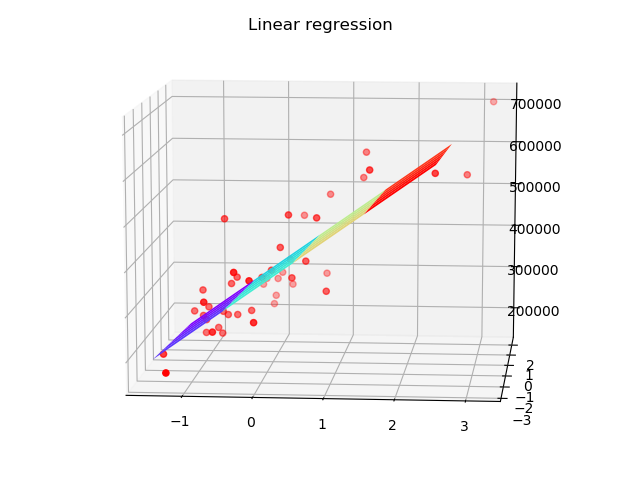
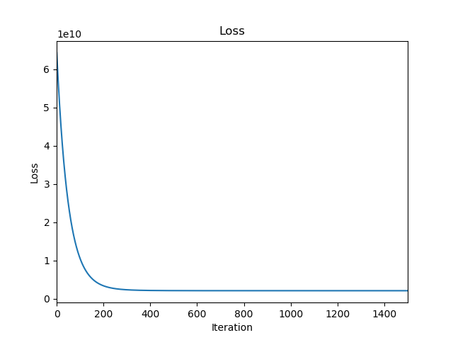
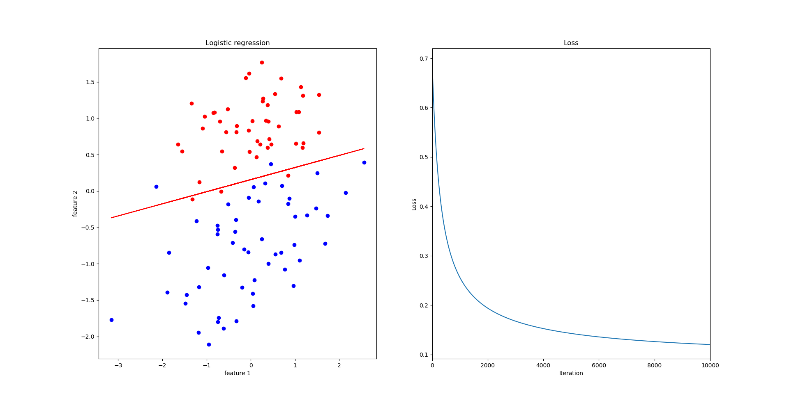

# Overfitting

## Regularization Cost Function

### Regularization

**ideas**
Small values for parameters $\theta_0,\theta_1,\dots,\theta_n$
- "Simpler" hyphothesis
- Less prone to overfitting

**cost function**

$$J(\theta)=\frac{1}{2m}\left[\sum_{i=1}^m(h_{\theta}(x^{(i)})-y^{(i)})^2+\lambda\sum_{j=1}^n\theta_j^2\right]$$

### Regularized Linear Regression

Repeat {

$$\theta_0:=\theta_0-\alpha\frac{1}{m}\sum_{i=1}^m(h_{\theta}(x^{(i)})-y^{(i)})x_0^{(i)}\\\theta_j:=\theta_j-\alpha\left[\frac{1}{m}\sum_{i=1}^m(h_{\theta}(x^{(i)})-y^{(i)})x_j^{(i)}+\frac{\lambda}{m}\theta_j\right]\\(j=1,2,3,\dots,n)$$

}

- 一步推导

$$\theta_j:=\theta_j(1-\alpha\frac{\lambda}{m})-\alpha\frac{1}{m}\sum_{i=1}^m(h_{\theta}(x^{(i)})-y^{(i)})x_j^{(i)}$$

### Normal equation

$$X=\begin{bmatrix}(x^{(1)})^T\\\vdots\\(x^{(m)})^T\end{bmatrix}\ \ \ \ y=\begin{bmatrix}y^{(1)}\\\vdots\\y^{(m)}\end{bmatrix}$$

- 正则化后的标准方程
- 可以解决由于$m \le n$导致的$X^TX$为奇异矩阵的问题。

$$\theta=\left(X^TX+\lambda
\begin{bmatrix}
0 &\ &\ &\ &\ \\
\ &1 &\ &\ &\ \\
\ &\ &1 &\ &\ \\
\ &\ &\ &\ddots &\ \\
\ &\ &\ &\ &1
\end{bmatrix}\right)^{-1}X^Ty$$

### Regularized Logistic Regression

**Cost function**

$$J(\theta)=-\left[\frac{1}{m}\sum_{i=1}^my^{(i)}\log h_{\theta}(x^{(i)})+(1-y^{(i)})\log(1-h_\theta(x^{(i)}))\right]+\frac{\lambda}{2m}\sum_{j=1}^n\theta_j^2$$

**Gradient descent**

Repeat {

$$\theta_0:=\theta_0-\alpha\frac{1}{m}\sum_{i=1}^m(h_{\theta}(x^{(i)})-y^{(i)})x_0^{(i)}\\\theta_j:=\theta_j-\alpha\left[\frac{1}{m}\sum_{i=1}^m(h_{\theta}(x^{(i)})-y^{(i)})x_j^{(i)}+\frac{\lambda}{m}\theta_j\right]\\(j=1,2,3,\dots,n)$$

}

**Advanced optimization**

*matlab*
$$function \ [jVal, gradient] = costFunction(theta)\\\begin{align}
&jval = [code\ to\ compute\ J(\theta)]\\
&gradient(1)\ = [code \ to \ compute \ \frac{\partial}{\partial\theta_0}J(\theta)]\\&gradient(2) \ = \ [code \ to \ compute \ \frac{\partial}{\partial\theta_1}J(\theta)]\\ &\vdots\\&gradient(n+1) \ = \ [code \ to \ compute \ \frac{\partial}{\partial\theta_n}J(\theta)]\end{align} $$

## Exercise

- 基于前面线性回归、逻辑回归的代码，加入了正则化的部分。如下的函数有些许改动：

**linear_regression.py**
``` python
def computeCost(self, X, y, theta, lamb_da):
        m = len(y)
        J = 0
        J = (np.sum((X.dot(theta) - y) ** 2) + lamb_da * np.sum(theta**2)) / (2 * m)
        return J

    def gradientDescent(self, X, y):
        m = len(y)
        for i in range(self.num_iters):
            regulation = self.theta * self.lamb_da
            regulation[0] = 0
            self.theta = self.theta - self.alpha / m * (X.T.dot(X.dot(self.theta) - y) + regulation)
            J = self.computeCost(X, y, self.theta, self.lamb_da)
            yield J
```

**logistic_regression.py**
``` python
def computeCost(self, X, y, theta, lamb_da):
        m = len(y)
        h = self.sigmoid(X.dot(theta))
        J = - (y.T.dot(np.log(h)) + (1.0 - y).T.dot(np.log(1.0 - h))) / m + lamb_da / (2 * m) * np.sum(theta**2)
        return np.sum(J)
    
    def gradientDescent(self, X, y):
        m = len(y)
        for i in range(self.num_iters):
            h = self.sigmoid(X.dot(self.theta))
            regulation = self.lamb_da * self.theta
            regulation[0] = 0
            self.theta = self.theta - self.alpha / m * (X.T.dot(h - y) + regulation)
            J = self.computeCost(X, y, self.theta, self.lamb_da)
            yield J
```

## Exercise

- 首先，在加入了正则化与归一化等处理细节后，将线性回归的多特征实验完成。结果如下：




- 重新更改了逻辑回归的部分细节。得到结果如下：

