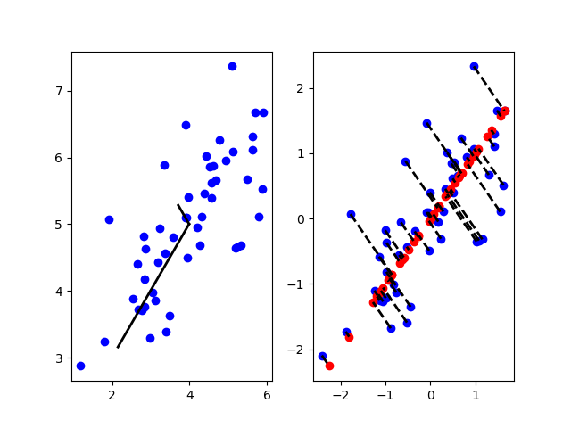
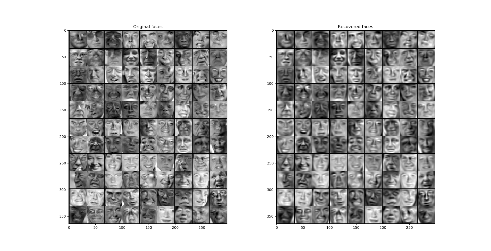

# Dimensionality Reduction

**For**
1. Data Compression
2. Data Visualization


## Principal Component Analysis (PCA)

- Reduce from n-dimension to k-dimension:

$$\mbox{Find } k \mbox{ vectors } u^{(1)},u^{(2)},\dots,u^{(k)} \mbox{ onto which to project the data, so as to minimize the projection error.}$$

**1. Compute "covariance matrix"**

$$\Sigma = \frac{1}{m} \sum_{i=1}^n(x^{(i)})(x^{(i)})^T$$

**2.Compute "eigenvectors" of matrix $\Sigma$**

``` matlab
[U,S,V] = svd(Sigma);
```

we get:

$$U = \begin{bmatrix}
| & | & \ & | \\
u^{(1)} & u^{(2)} & \dots & u^{(n)}\\
| & | & \ & |
\end{bmatrix} \in \mathbb R^{n \times n}$$

reduce dimensionality:

``` matlab
Ureduce = U(:,1:k);
z = Ureduce'*x;
```

## Chooosing $k$ (number of principal components)

- Average squared projection error: $\frac{1}{m} \sum_{i=1}^m \| x^{(i)} - x_{approx}^{(i)} \|^2 $
- Total variation in the data: $\frac{1}{m} \sum_{i=1}^m \| x^{(i)} \|^2$

- Typically, choose $k$ to be smallest value so that:

$$\frac{\frac{1}{m} \sum_{i=1}^m \| x^{(i)} - x_{approx}^{(i)} \|^2}{\frac{1}{m} \sum_{i=1}^m \| x^{(i)} \|^2} \leq 0.01$$

**99% of varianve is retained**

### Algorithm

``` matlab
[U,S,V] = svd(Sigma);
```

Pick smallest value of $k$ for which 

$$\frac{\sum_{i=1}^kS_{ii}}{\sum_{i=1}^mS_{ii}} \geq 0.99$$

**99% of varianve is retained**

## Reconstraction from Compressed Representation

we know:

$$z = U_{reduce}^T x \in \mathbb R^k$$

reconstraction:

$$x_{approx}=U_{reduce} z \in \mathbb R^n$$

## Addvice for Applying PCA

### Supervised learning speedup

$(x^{(1)},y^{(1)}),(x^{(2)},y^{(2)}),\dots,(x^{(m)},y^{(m)})$

**Extract inputs:**
**Unlabeled dataset:**

$$\begin{align}
x^{(1)},x^{(2)},&\dots,x^{(m)} \in \mathbb R^{10000} \\
& \downarrow PCA \\
z^{(1)},z^{(2)},&\dots,z^{(m)} \in \mathbb R^{1000}
\end{align}$$

**New training set:**

$(z^{(1)},y^{(1)}),(z^{(2)},y^{(2)}),\dots,(z^{(m)},y^{(m)})$

**Note:**

Mapping $x^{(i)} \to z^{(i)}$ should be defined by running PCA only on the training set. This mapping can be applied as well to the examples $x_{cv}^{(i)}$ and $x_{test}^{(i)}$ in the cross validation and test sets.

### Application of PCA

- Compression
    - Reduce memory/disk needed to store data
    - Speed up learning algorithm

- Visualization

## Exercise

- 课程原实验包括：pca可视化；用于人脸数据降维、重建

**pca.py**

``` python
# -*- coding: utf-8 -*-
"""
Created on Mon Jul 30 20:41:36 2018

@author: 周宝航
"""

import numpy as np
import numpy.linalg as la

class PCA(object):
    
    def __init__(self):
        pass
    
    def featureNormalize(self, X):
        m, n = X.shape
        X_norm = X;
        mu = np.zeros((1, n))
        sigma = np.zeros((1, n))
        for i in range(n):
            mu[0, i] = np.mean(X[:,i])
            sigma[0, i] = np.std(X[:,i])
        X_norm  = (X - mu) / sigma
        return X_norm,mu,sigma
    
    def pca(self, X):
        m, n = X.shape
        X_norm = X.T.dot(X) / m
        U,S,_ = la.svd(X_norm)
        return U,S
    
    def projectData(self, X, U, K):
        U_reduce = U[:, :K]
        Z = X.dot(U_reduce)
        return Z
    
    def recoverData(self, Z, U, K):
        U_reduce = U[:, :K]
        X = Z.dot(U_reduce.T)
        return X
```

**main.py**

``` python
# -*- coding: utf-8 -*-
"""
Created on Mon Jul 30 20:44:41 2018

@author: 周宝航
"""

from pca import PCA
import numpy as np
import scipy.io as sio
import matplotlib.pyplot as plt

# ================== Load Example Dataset  ===================
data = sio.loadmat('data\\ex7data1.mat')
X = data['X']
m, n = X.shape

fig = plt.figure()
ax = fig.add_subplot(1,2,1)

ax.plot(X[:, 0], X[:, 1], 'bo')

# =============== Principal Component Analysis ===============
pca = PCA()

X_norm, mu, sigma = pca.featureNormalize(X)

U, S = pca.pca(X_norm)

p1 = mu
p2 = mu + 1.5 * S[0] * U[:, 0].T
data = np.r_[p1, p2].reshape([-1, 2])
ax.plot(data[:, 0], data[:, 1], '-k', linewidth=2)
p2 = mu + 1.5 * S[1] * U[:, 1].T
data = np.r_[p1, p2].reshape([-1, 2])
ax.plot(data[:, 0], data[:, 1], '-k', linewidth=2)

# =================== Dimension Reduction ===================
ax = fig.add_subplot(1,2,2)
ax.plot(X_norm[:, 0], X_norm[:, 1], 'bo')

K = 1

Z = pca.projectData(X_norm, U, K)

X_rec = pca.recoverData(Z, U, K)

ax.plot(X_rec[:, 0], X_rec[:, 1], 'ro')


for i in range(m):
    data = np.r_[X_norm[i, :], X_rec[i, :]].reshape([-1, 2])
    ax.plot(data[:, 0], data[:, 1], '--k', linewidth=2)

# =============== Loading and Visualizing Face Data =============
def displayData(X):
    m, n = X.shape
    example_width = np.int(np.sqrt(n))
    example_height = np.int(n / example_width)
    display_rows = np.int(np.floor(np.sqrt(m)))
    display_cols = np.int(np.ceil(m / display_rows))
    pad = 1;
    
    display_array = - np.ones([pad + display_rows * (example_height + pad),\
                       pad + display_cols * (example_width + pad)])
    curr_ex = 0
    for j in range(display_rows):
        for i in range(display_cols):
            if curr_ex == m:
                break
            max_val = max(abs(X[curr_ex, :]))
            row = pad+j*(example_height + pad)+1
            col = pad+i*(example_width + pad)+1
            display_array[row:row+example_height, col:col+example_width] = \
                            X[curr_ex, :].reshape([example_height, example_width]) / max_val
            curr_ex += 1
        if curr_ex == m:
            break
    plt.imshow(display_array.T, cmap='gray')
    
data = sio.loadmat('data\\ex7faces.mat')
X = data['X']

#displayData(X[1:100, :])

# =========== PCA on Face Data: Eigenfaces  ===================
X_norm, mu, sigma = pca.featureNormalize(X)

U, S = pca.pca(X_norm)

#displayData(U[:, 1:36].T)

K = 100
Z = pca.projectData(X_norm, U, K)

# ==== Visualization of Faces after PCA Dimension Reduction ====
X_rec  = pca.recoverData(Z, U, K)

fig = plt.figure()

original = fig.add_subplot(1, 2, 1)
original.set_title('Original faces')
displayData(X_norm[1:100,:])

recovered = fig.add_subplot(1, 2, 2)
recovered.set_title('Recovered faces')
displayData(X_rec[1:100,:])
```

**结果1**

- 左图代表数据经过PCA处理得到的主成分方向。
- 右图中，蓝点表示原始数据、红点表示降维后的数据。虚线表示原始数据到降维后数据的映射。



**结果2**

- 左图为原始人脸图像数据，而右侧为降维后恢复的人脸数据。

