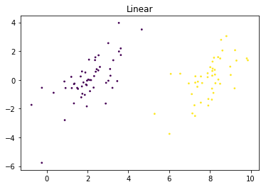
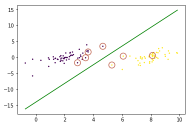
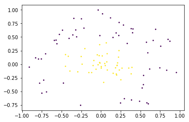
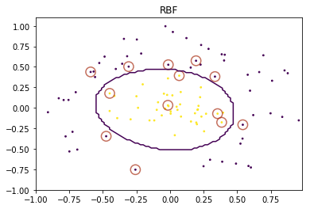

# Support Vector Machine

## Logistic regression

$$\mathop{min}_{\theta} \frac{1}{m} \left [ \sum_{i=1}^m y^{(i)} \left ( -\log h_{\theta}(x^{(i)}) \right )+ (1-y^{(i)}) \left (  (-\log (1-h_{\theta}(x^{(i)})) \right ) \right ] + \frac{\lambda}{2m} \sum_{j=1}^n \theta^2$$

### SVM hypothesis

$$\mathop{min}_{\theta}C \sum_{i=1}^m \left[ y^{(i)}cost_1(\theta^Tx^{(i)})+(1-y^{(i)})cost_0(\theta^Tx^{(i)}) \right]+\frac{1}{2}\sum_{i=1}^n \theta_j^2$$

## Large Margin Intuition

- if $y=1$, we want $\theta^T x \geq 1$ (not just $\geq 0$)
- if $y=0$, we want $\theta^T x \leq -1$ (not just $< 0$)

**Target**

$$\begin{align}
& \mathop{min}_{\theta} \frac{1}{2}\sum_{j=1}^n \theta_j^2 \\
\mbox{s.t.} \quad & \theta^Tx^{(i)} \ge 1 \quad \mbox{if} \ \  y^{(i)} = 1 \\
& \theta^T x^{(i)} \leq -1 \quad \mbox{if} \ \ y^{(i)} = 0
\end{align}$$

## Kernels

- Given $x$, compute new feature depending on poximity to landmarks $l^{(1)}, l^{(2)}, l^{(3)}$

$$\begin{align}
f_1 = \mbox{similarity}(x, l^{(1)}) = \exp \left( - \frac{\| x - l^{(1)} \|^2}{2 \sigma^2} \right) \\
f_2 = \mbox{similarity}(x, l^{(2)}) = \exp \left( - \frac{\| x - l^{(2)} \|^2}{2 \sigma^2} \right) \\
f_3 = \mbox{similarity}(x, l^{(3)}) = \exp \left( - \frac{\| x - l^{(3)} \|^2}{2 \sigma^2} \right) \\
\end{align}$$

- That $\mbox{similarity()}$ function is called **Gaussian Kernel Function**

- Predict $y=1$ if $\theta_0+\theta_1f_1+\theta_2f_2+\theta_3f_3 \geq 0$

### SVM with Kernels

- Given $(x^{(1)}, y^{(1)}),(x^{(2)},y^{(2)}),(x^{(3)},y^{(3)}),\dots,(x^{(m)},y^{(m)})$
- choose $l^{(1)}=x^{(1)},l^{(2)}=x^{(2)},\dots,l^{(m)}=x^{(m)}$
- Given example $x$:

$$\begin{align}
& f_1 = \mbox{similarity} (x, l^{(1)}) \\
& f_2 = \mbox{similarity} (x, l^{(2)}) \\
& \cdots
\end{align}$$

- For training exmaple $(x^{(i)}, y^{(i)})$:

$$x^{(i)} \to \begin{align}
& f_1^{(i)} = \mbox{similarity} (x^{(i)}, l^{(1)}) \\
& f_2^{(i)} = \mbox{similarity} (x^{(i)}, l^{(2)}) \\
& \vdots \\
& f_m^{(i)} = \mbox{similarity} (x^{(i)}, l^{(m)})
\end{align}$$

### Hypothesis

- Given $x$, compute features $f \in \mathbb R^{m+1}$
	- Predict $y=1$ if $\theta^T f \geq 0$

**Training : **

$$\mathop{min}_{\theta}C \sum_{i=1}^m \left[ y^{(i)}cost_1(\theta^Tf^{(i)})+(1-y^{(i)})cost_0(\theta^Tf^{(i)}) \right]+\frac{1}{2}\sum_{i=1}^m \theta_j^2$$

## SVM parameters

$$C(=\frac{1}{\lambda})$$

1. Large C : Lower bias, high variance.
2. Small C: Higher bias, low variance.

$$\sigma^2$$

1. Large $\sigma^2$: Feature $f_i$ vary more smoothly. High bias, lower variance.
2. Small $\sigma^2$: Feature $f_i$ vary less smoothly. Lower bias, high variance.

## Training Algorithm

> 《机器学习》-- 周志华

- 完成实验部分主要参考了上面这本书，和下面的博客。

### SMO（序列最小优化算法）
> [SVM算法原理](https://www.jianshu.com/p/2716f4028152?utm_campaign=maleskine&utm_content=note&utm_medium=seo_notes&utm_source=recommendation)
> [机器学习算法实践-SVM中的SMO算法](https://zhuanlan.zhihu.com/p/29212107)


### 梯度下降法

> [svm随机梯度下降算法-pegasos](https://blog.csdn.net/sinat_27612639/article/details/70037499)


## Exercise

[Github地址](https://github.com/zhoubaohang/machine-learning-notes/tree/master/Cousera/Support%20Vector%20Machine)

- 支持向量机实验
- 参阅了教材和网上的博客，实现了SMO算法，完成了线性与非线性的数据分类。

> 《机器学习》——周志华

> [支持向量机之教你用python一步一步实现一个简易的SMO算法](https://baijiahao.baidu.com/s?id=1590893975108327505&wfr=spider&for=pc)

> [SVM算法原理](https://www.jianshu.com/p/2716f4028152?utm_campaign=maleskine&utm_content=note&utm_medium=seo_notes&utm_source=recommendation)


```python
# 导入需要使用的包
from svm import SVM, KERNEL_GAUSSIAN, KERNEL_LINEAR
import numpy as np
import matplotlib.pyplot as plt

%matplotlib inline
```

## 线性部分


```python
# figure 对象，可视化数据
fig = plt.figure()

#加载数据
data = np.loadtxt(open("data\\dataLine.csv","rb"),delimiter=",",skiprows=0)
X = data[:, :-1].T
y = data[:, -1].reshape([1, -1])

# 可视化数据
plt.title("Linear")
plt.scatter(X[0, :],X[1, :],c=y.flatten(),s=3,marker='o')
```
    <matplotlib.collections.PathCollection at 0x20e3997d860>



```python
# 实例化 SVM 对象
# C : 松弛变量
# toler : 容忍度
# iter_num : 迭代次数
svm = SVM(KERNEL_LINEAR, C=0.6, toler=0.0001, iter_num=40)

# 调用训练方法
svm.fit(X, y)
```

```python
fig = plt.figure()
ax_lin = fig.add_subplot(1,1,1)
ax_lin.scatter(X[0, :],X[1, :],c=y[0],s=3,marker='o')

# 找出支持向量
# alpha 中不为0的值，对应的数据就是支持向量
svInd = np.nonzero(svm.alpha > 0)[1].tolist()
for sv in svInd:
    plt.scatter(X[0, sv], X[1, sv], s=150, c='none', alpha=0.7, linewidth=1.5, edgecolor='#AB3319')

# 画出决策边界
w0, w1 = svm.w[0], svm.w[1]
x0 = min(X[0, :])
x1 = max(X[0, :])
y0, y1 = (- svm.b - w0 * x0)/w1, (-svm.b - w0 * x1)/w1

ax_lin.plot([x0,x1], [y0,y1], '-g')
```


    [<matplotlib.lines.Line2D at 0x20e39a280f0>]





## 非线性部分


```python
# 加载实验数据
data = np.loadtxt(open("data\\dataRBF.csv","rb"),delimiter=",",skiprows=0)
X = data[:, :-1].T
y = data[:, -1].reshape([1, -1])

# 数据可视化
plt.scatter(X[0, :],X[1, :],c=y.flatten(),s=3,marker='o')
```


    <matplotlib.collections.PathCollection at 0x1ab108df518>





```python
# 实例化 SVM 对象
# C : 松弛变量
# toler : 容忍度
# iter_num : 迭代次数
# sigma : 方差
svm = SVM(KERNEL_GAUSSIAN, C=200, toler=0.0001, iter_num=500, sigma=0.6)

# 调用训练方法
svm.fit(X, y)
```
```python
fig = plt.figure()
ax_rbf = fig.add_subplot(1,1,1)
ax_rbf.set_title("RBF")
ax_rbf.scatter(X[0, :],X[1, :],c=y.flatten(),s=3,marker='o')

# 找出支持向量
# alpha 中不为0的值，对应的数据就是支持向量
svInd = np.nonzero(svm.alpha > 0)[1].tolist()
for sv in svInd:
    ax_rbf.scatter(X[0, sv], X[1, sv], s=150, c='none', alpha=0.7, linewidth=1.5, edgecolor='#AB3319')

rg = np.arange(-1.0, 1.0, 0.02)
X0, X1 = np.meshgrid(rg, rg)

predict = svm.predict(np.r_[X0.reshape([1, -1]), X1.reshape([1, -1])])

ax_rbf.contour(X0, X1, predict.reshape(X0.shape), 1)
```

    <matplotlib.contour.QuadContourSet at 0x1ab10a41cc0>





