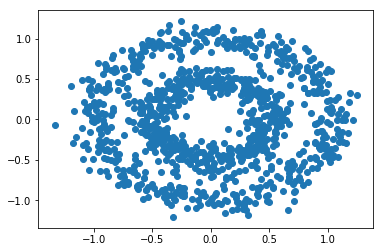

# DBSCAN

> 《机器学习》-周志华

- Density-Based Spatial Clustering of Applications with Noise

- 该算法属于密度聚类的一种。它基于一组“邻域”参数($\epsilon, MinPts$)来刻画样本分布的紧密程度。

## 基本概念

- 给定数据集 $D=\{x_1, x_2, \dots, x_m \}$

1. $\epsilon-$邻域：对$x_j \in D$，其$\epsilon-$邻域包含样本集D中与$x_j$的距离不大于$\epsilon$的样本，即：$N_\epsilon(x_j)=\{x_i \in D | \mbox{dist}(x_i, x_j) \leq \epsilon \}$

2. 核心对象（core object）：若$x_j$的$\epsilon-$邻域至少包含**MinPts**个样本，即：$|N_\epsilon(x_j)| \geq MinPts$，则$x_j$是一个核心对象。

3. 密度直达（directly density-reachable）：若$x_j$位于$x_i$的$\epsilon-$邻域中，且$x_i$是核心对象，则称$x_j$由$x_i$密度直达

4. 密度可达（density-reachable）：对$x_i$与$x_j$，若存在样本序列$p_1,p_2,\dots,p_n$，其中$p_1 = x_i, p_n = x_j$且$p_{i+1}$由$p_i$密度直达，则称$x_j$由$x_i$密度可达

5. 密度相连（density-connected）：对$x_i$与$x_j$，若存在$x_k$使得$x_i$与$x_j$均由$x_k$密度可达，则称$x_i$与$x_j$密度相连

- 基于上面的这些概念，**DBSCAN**算法将“簇”定义为：由密度可达关系导出的最大的密度相连样本集合。
- 给定邻域参数$(\epsilon, MinPts)$，簇$C  \subseteq D$是满足以下性质的非空样本子集：
	1. 连接性（connectivity）：$x_i \in C, x_j \in C \Rightarrow x_i$ 与 $x_j$密度相连
	2. 最大性（maximality）：$x_i \in C, x_j$由$x_i$密度可达$\Rightarrow x_j \in C$

## 算法流程


- 在1-7行中，算法先根据邻域参数找出所有核心对象；
- 然后在10-24行中，以任意核心对象为出发点，找出由其密度可达的样本生成聚类簇，直到所有核心对象均被访问过为止。

## 实验部分

```python
from dbscan import DBSCAN
import numpy as np
import matplotlib.pyplot as plt
from sklearn.datasets import make_circles, make_blobs
from sklearn.model_selection import train_test_split
from sklearn.datasets import load_iris

%matplotlib inline
```


```python
# 生成数据
X, y = make_circles(n_samples=1000, factor=0.5, noise=0.1)

plt.scatter(X[:, 0], X[:, 1])
```


    <matplotlib.collections.PathCollection at 0x20baf900c18>





```python
# DBSCAN 参数

# 衡量距离
epsilon = 0.12
# 近邻数
MinPts = 8

# 实例化分类器
clf = DBSCAN(epsilon, MinPts)
# 训练
clf.fit(X)

# 可视化训练结果
plt.scatter(X[:, 0], X[:, 1], c=clf.fit_label_())
```


    <matplotlib.collections.PathCollection at 0x20bb0a2d860>


- 通过调节参数，最后可以得到比较理想的结果。近邻参数$\epsilon, MinPts$是该算法的关键。
- 可能调节的过程很漫长，不过基本的原则就是：在聚类效果不明显时，增大$\epsilon$或者增大$MinPts$。

## 数据集测试


```python
# 生成数据
X1, y1 = make_circles(n_samples=500, factor=0.05, noise=0.1)
X2, y2 = make_blobs(n_samples=500, n_features=2, centers=[[1.2,1.2]], cluster_std=[[.1]],random_state=9)
X = np.r_[X1, X2]
y = np.r_[y1, y1]

plt.scatter(X[:, 0], X[:, 1])
```

    <matplotlib.collections.PathCollection at 0x209714193c8>


```python
# DBSCAN 参数

# 衡量距离
epsilon = 0.2
# 近邻数
MinPts = 8

# 实例化分类器
clf = DBSCAN(epsilon, MinPts)
# 训练
clf.fit(X)

# 可视化训练结果
plt.scatter(X[:, 0], X[:, 1], c=clf.fit_label_())
```


    <matplotlib.collections.PathCollection at 0x209715d8550>


