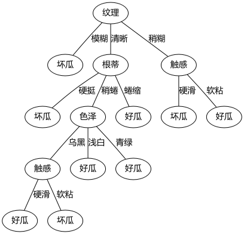

# 决策树

> 参考《机器学习》- 周志华

- 决策树是基于树形结构来进行决策的，这正如人类面对问题时的一种处理机制。比如：我们在挑选水果时，可能先考查它的“外表”，然后是“口感”等一系列问题，最后得出这个水果是否值得购买。
- 一般来说，一颗决策树包含一个根节点、若干内部结点和若干子结点；叶结点对应于决策结果，其他结点则对应于一个属性测试。

## 学习算法

**输入：** 
训练集 $D=\{(x_1,y_1),(x_2,y_2),\dots,(x_m, y_m) \}$
属性集 $A = \{a_1,a_2,\dots,a_d \}$
过程：函数**GenerateTree(D,A)**

1. 生成结点 node
2. if $D$ 中样本全属于同一类别 then
	- 将node标记为 C 类叶结点；return 
3. if A 为空集 or D 中样本在A上取值相同 then
   - 将 node 标记为叶结点，其类别标记为D中样本数最多的类；return
4. 从A中选择最优划分属性$a_*$
5. for $a_*$中的每一个值$a_*^v$do：
	- 为 node 生成一个分支；令 Dv 表示D中在$a_*$上取值为$a_*^v$的样本子集；
    - if $D_v$为空 then
    	- 将分支结点标记为叶结点，其类别标记为D中样本最多的类；return
    - else
    	- 以 **GenerateTree($D_v, A \setminus \{ a_*\}$)**为分支结点

**输出：** 以node为根节点的一颗决策树

### 信息熵
- 信息熵(information entropy)是度量样本集合纯度最常用的一种指标。
- 假定当前样本$D$中第$k$类样本所占的比例为$p_k(k=1,2,\dots,|y|)$,则$D$的信息熵定义为：

$$Ent(D)=-\sum_{k=1}^{|y|}p_k\log_2p_k$$

Ent(D)的值越小，则D的纯度越高。

- 假定离散属性$a$中有$V$个可能的取值$\{a^1,a^2,\dots,a^V \}$。若使用$a$来对样本集$D$进行划分，则会产生$V$个分支结点，其中第$v$个分支结点包含了$D$中所有在属性$a$上取值为$a^v$的样本，即为$D^v$.

### 信息增益
$$Gain(D,a) = Ent(D) - \sum_{v=1}^V\frac{|D^v|}{|D|}Ent(D^v)$$

信息增益越大，则意味着使用属性$a$来进行划分所获得的"纯度提升"越大。因此，我们可以使用信息增益来进行决策树的划分属性选择。

上面算法流程中，第4行选择属性 $a_*=\mathop{\arg \max}_{a\in A} \mbox{Gain}(D,a)$

> **ID3算法**是以信息增益作为准则来选择划分属性。

### 增益率
> C4.5决策树算法使用该指标

$$\mbox{Gain_ratio}(D,a)=\frac{\mbox{Gain(D,a)}}{\mbox{IV(a)}}$$

其中：

$$\mbox{IV(a)}=-\sum_{v=1}^V\frac{|D^v|}{|D|}\log_2\frac{|D^v|}{|D|}$$

### 基尼指数
> CART决策树使用该指标

数据集D的纯度可用基尼值来衡量：
$$Gini(D)=\sum_{k=1}^{|y|}\sum_{k` \neq k}p_k p_{k`}=1-\sum_{k=1}^{|y|}p_k^2$$

属性a的基尼指数定义为：
$$\mbox{Gini_index(D,a)=}\sum_{n=1}^V\frac{|D^v|}{|D|}\mbox{Gini}(D^v)$$

最优划分属性为：
$$a_*=\mathop{\arg \min}_{a \in A} \mbox{Gini_index(D,a)}$$

## 剪枝处理
- 防止过拟合

### 预剪枝

- 在划分前，所有样本集中在根节点。若不进行划分，则根据算法中的要求，该结点被标记为叶结点，其类别标记为训练样本数最多的类别。然后计算此时的验证精度。
- 然后，得到最优划分属性。按照该属性划分叶结点，同理标记为训练样本数最多的类别。再次计算划分属性后的验证精度。
- 若划分后，验证精度上升，则用该属性划分。

**注：**
- 降低了过拟合的风险，还显著减少了决策树的训练时间开销和测试时间开销。
- 有带来欠拟合的风险。

### 后剪枝

- 先从训练集生成一颗完整的决策树。
- 然后从非叶结点向上，针对每个非叶结点考查，若将其替换为叶结点，此时决策树的验证精度是否上升。若上升，则进行剪枝操作。
- 重复上述步骤，直至根节点。

**注：**
- 后剪枝决策树的欠拟合风险很小，泛化性能往往优于预剪枝决策树。
- 但其训练时间开销比未剪枝决策树和预剪枝决策树都要大得多。

## 连续与缺失值

### 连续值
- 现实中，我们经常会遇到的是连续属性。
- C4.5算法中，采用的是二分法机制。

1. 给定样本集$D$和连续属性$a$，假定$a$在$D$上出现了$n$个不同的取值，将这些值从小到大进行排序，记为:$\{a^1,a^2,\dots,a^n \}$.
2. 基于划分点$t$可将$D$分为子集$D_t^-$和$D_t^+$，其中$D_t^-$包含那些在属性$a$上取值不大于$t$的样本，而$D_t^+$则包含那些在属性$a$上取值大于$t$的样本。
3. 对于连续属性a，我们可以考察包含$n-1$个元素的候选划分点集合。

$$T_a=\{ \frac{a^i+a^{i+1}}{2}|1\leq i \leq n-1 \}$$

可以得到信息的信息增益函数：
$$\begin{align}
\mbox{Gain(D,a)} = & \max_{t \in T_a} \mbox{Gain(D,a,t)}\\
= &\max_{t \in T_a} \mbox{Ent(D)} - \sum_{\lambda \in \{-,+\}} \frac{|D_t^{\lambda}|}{|D|} \mbox{Ent}(D_t^{\lambda})
\end{align}$$

### 缺失值
1. 给定样本集$D$和连续属性$a$，令$\tilde D$表示$D$在属性$a$上没有缺失值的样本子集。
2. 假定属性$a$有$V$个可取值$\{a^1,a^2,\dots,a^V \}$，令$\tilde D^v$表示$D^v$中在属性$a$上取值为$a^v$的样本子集，则显然有$\tilde D = \bigcup_{k=1}^{|y|} \tilde D_k $,$\tilde D = \bigcup_{v=1}^V \tilde D^v$。
3. 假定我们为每个样本$x$赋予一个权重$\omega_x$，并定义：

$$\begin{align}
\rho &= \frac{\sum_{x \in \tilde D}\omega_x}{\sum_{x \in D} \omega_x} \\
\tilde p_k &= \frac{\sum_{x \in \tilde D_k} \omega_x}{\sum_{x \in \tilde D} \omega_x} \quad (1 \leq k \leq |y|) \\
\tilde r_v &= \frac{\sum_{x \in \tilde D^v} \omega_x}{\sum_{x \in \tilde D} \omega_x} \quad (1 \leq v \leq V)
\end{align}$$

**对于属性a**:

- $\rho$ 表示无缺失值样本所占的比例。
- $\tilde p_k$ 表示无缺失值样本中第$k$类所占的比例。
- $\tilde r^v$ 表示无缺失值样本中在属性$a$上取值为$a^v$的样本所占的比例。
- 将信息增益公式推广为：

$$\begin{align}
\mbox{Gain(D,a)} &= \rho \times \mbox{Gain}(\tilde D, a) \\
&= \rho \times \left( \mbox{Ent}(\tilde D) - \sum_{v=1}^V \tilde r_v \mbox{Ent}(\tilde D^v) \right)
\end{align}$$

其中：
$$\mbox{Ent}(\tilde D) = -\sum_{k=1}^{|y|}\tilde p_k \log_2 \tilde p_k$$

## 练习

- 实现了一个简单的决策树算法，基于信息增益、基尼指数的生成决策树算法。
- 未处理连续值问题。
- 使用 **graphviz**可视化决策树。

结果图：


数据集：
```
编号,色泽,根蒂,敲声,纹理,脐部,触感,密度,含糖率,好坏
1,青绿,蜷缩,浊响,清晰,凹陷,硬滑,0.697,0.46,好瓜
2,乌黑,蜷缩,沉闷,清晰,凹陷,硬滑,0.744,0.376,好瓜
3,乌黑,蜷缩,浊响,清晰,凹陷,硬滑,0.634,0.264,好瓜
4,青绿,蜷缩,沉闷,清晰,凹陷,硬滑,0.608,0.318,好瓜
5,浅白,蜷缩,浊响,清晰,凹陷,硬滑,0.556,0.215,好瓜
6,青绿,稍蜷,浊响,清晰,稍凹,软粘,0.403,0.237,好瓜
7,乌黑,稍蜷,浊响,稍糊,稍凹,软粘,0.481,0.149,好瓜
8,乌黑,稍蜷,浊响,清晰,稍凹,硬滑,0.437,0.211,好瓜
9,乌黑,稍蜷,沉闷,稍糊,稍凹,硬滑,0.666,0.091,坏瓜
10,青绿,硬挺,清脆,清晰,平坦,软粘,0.243,0.267,坏瓜
11,浅白,硬挺,清脆,模糊,平坦,硬滑,0.245,0.057,坏瓜
12,浅白,蜷缩,浊响,模糊,平坦,软粘,0.343,0.099,坏瓜
13,青绿,稍蜷,浊响,稍糊,凹陷,硬滑,0.639,0.161,坏瓜
14,浅白,稍蜷,沉闷,稍糊,凹陷,硬滑,0.657,0.198,坏瓜
15,乌黑,稍蜷,浊响,清晰,稍凹,软粘,0.36,0.37,坏瓜
16,浅白,蜷缩,浊响,模糊,平坦,硬滑,0.593,0.042,坏瓜
17,青绿,蜷缩,沉闷,稍糊,稍凹,硬滑,0.719,0.103,坏瓜
```

**main.py**
```python
# -*- coding: utf-8 -*-
"""
Created on Fri Aug 17 09:49:10 2018

@author: 周宝航
"""

import numpy as np

data = np.loadtxt('data.txt', delimiter=',', dtype=str)

X = data[1:, 1:7]
y = data[1:, -1]

features = []

for i, label in enumerate(data[0, 1:7].tolist()):
    features.append([label, np.unique(X[:, i]).tolist()])

#%%
from decision_tree import DecisionTree, GINI_INDEX, INFOENT

tree = DecisionTree(features, index=INFOENT)

tree.fit(X, y)

tree.plotTree()
```

**decision_tree.py**
```python
# -*- coding: utf-8 -*-
"""
Created on Fri Aug 17 12:17:27 2018

@author: 周宝航
"""

from collections import Counter
import numpy as np
from graphviz import Digraph
import copy


GINI_INDEX = 'gini'

INFOENT = 'info'

class DecisionTree(object):
    
    def __init__(self, features, index=INFOENT):
        # features list
        self.features = features
        # information index
        self.index = index
        
    def calcGini(self, data):
        
        assert type(data) == list, 'data type error, data should be list'
        
        m = len(data)
        gini = 1.0
        cnt = Counter(str(i) for i in data)
        
        for k, v in cnt.items():
            gini -= np.power(v / m, 2)
    
        return gini
    
    def calcGiniIndex(self, X, y):
        
        D = len(X)
        cntX = Counter(str(i) for i in X.flatten())
        y = y.flatten()
        
        gini_index = 0.0
        
        for xfet, xfreq in cntX.items():
             y_fet = y[np.where(X == xfet)[0]]
             Dv = len(y_fet)
             gini_index += Dv / D * self.calcGini(y_fet.tolist())
        
        return gini_index
    
    def calcInfoEnt(self, data):
        
        assert type(data) == list, 'data type error, data should be list'
        
        m = len(data)
        ent = 0.0
        cnt = Counter(str(i) for i in data)
        
        for k, v in cnt.items():
            ent -= (v / m) * np.log2(v / m)
    
        return ent
    
    def calcInfoGain(self, X, y):
        
        D = len(X)
        cntX = Counter(str(i) for i in X.flatten())
        y = y.flatten()
        ent = self.calcInfoEnt(y.tolist())
        
        for xfet, xfeq in cntX.items():
            y_fet = y[np.where(X == xfet)[0]]
            Dv = len(y_fet)
            ent -= Dv / D * self.calcInfoEnt(y_fet.tolist())
    
        return ent
    
    def calcInfoGainRatio(self, X, y):
        
        D = len(X)
        cntX = Counter(str(i) for i in X.flatten())
        y = y.flatten()
        ent = self.calcInfoEnt(y.tolist())
        IV = 0.0
        
        for xfet, xfeq in cntX.items():
            y_fet = y[np.where(X == xfet)[0]]
            Dv = len(y_fet)
            ent -= Dv / D * self.calcInfoEnt(y_fet.tolist())
            IV -= Dv / D * np.log2(Dv / D)
    
        return ent / IV
            
    def chooseBestFeature(self, X, y, features):
        
        if self.index == GINI_INDEX:
            min_gini = 100
            fet = ''
            for i, feature in enumerate(features):
                gini = self.calcGiniIndex(X[:, i], y)
                if gini < min_gini:
                    min_gini = gini
                    fet = feature[0]
            return fet, min_gini
        elif self.index == INFOENT:
            max_Ent = 0.0
            fet = ''
            
            for i, feature in enumerate(features):
                ent = self.calcInfoGain(X[:, i], y)
                if ent > max_Ent:
                    max_Ent = ent
                    fet = feature[0]
            return fet, max_Ent
            
    def sameDataOnFet(self, X, y, sub_features):
        
        flag = True
        for i in range(len(sub_features)):
            if len(np.unique(X[:, i])) != 1:
                flag = False
                break
        return flag
    
    def majorityClass(self, y):
        feature = ''
        flag = 0
        cnt = Counter(str(i) for i in y)
        for k, v in cnt.items():
            if v > flag:
                feature = k
                flag = v
        return feature
    
    def predict(self, X):
        m = len(X)
        y = []
        for i in range(m):
            x = X[i, :]
            node = self.root
            while type(node) != str:
                feature = list(node.keys())[0]
                node = node[feature]
                fetIndex = self.features.index(feature)
                for k in node.keys():
                    if k == x[fetIndex]:
                        node = node[k]
                        break
            y.append(node)
        
        return y
    
    def fit(self, X, y):
        self.root = self.generateTree(X, y, self.features)
    
    def generateTree(self, X, y, features):
    
        cntY = np.unique(y)
        
        if len(cntY) == 1:
            node = str(cntY[0])
            return node
        
        if len(features) == 0 or self.sameDataOnFet(X, y, features):
            node = self.majorityClass(y)
            return node
        
        fet, ent = self.chooseBestFeature(X, y, features)
        
        node = None
        
        if fet == '':
            node = self.majorityClass(y)
        else:
            fetIndex = [features[i][0] for i in range(len(features))].index(fet)
            
            fetValues = features[fetIndex][1]
            
            node = {fet:{}}
            for val in fetValues:
                index = np.where(X[:,fetIndex] == val)[0]
                subX = X[index, :]
                subY = y[index]
                if len(index) == 0:
                    node[fet][val] = self.majorityClass(y)
                else:
                    subX = np.c_[subX[:, :fetIndex], subX[:, fetIndex+1:]]
                    subFeatures = copy.deepcopy(features)
                    subFeatures.pop(fetIndex)
                    node[fet][val] = self.generateTree(subX, subY, subFeatures)
            
        return node
        
    def plotTree(self):
    
        cache = []
        
        dot = Digraph("Tree", node_attr={"fontname":"Microsoft YaHei"},\
                      edge_attr={"fontname":"Microsoft YaHei", "arrowhead":"none"})
        
        cnt = 0
        cache.append([cnt, self.root])
        while len(cache):
            index, node = cache.pop(0)
            if type(node) == dict:
                feature = list(node.keys())[0]
                dot.node(str(index), feature)
                for value in node[feature].keys():
                    cnt += 1
                    dot.node(str(cnt))
                    dot.edge(str(index), str(cnt), value)
                    cache.append([cnt, node[feature][value]])
            elif type(node) == str:
                dot.node(str(index), node)            
        
        return dot
```