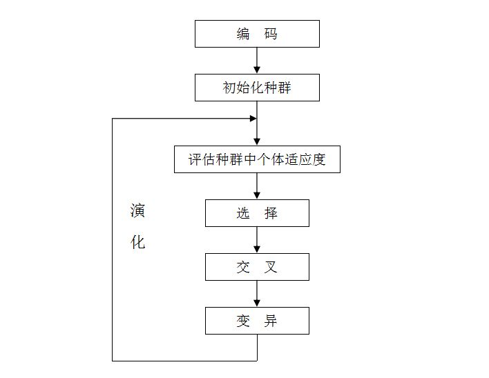

# 遗传算法

参考文章：
[莫烦Python](https://morvanzhou.github.io/tutorials/machine-learning/evolutionary-algorithm/2-00-genetic-algorithm/)
[【算法】超详细的遗传算法(Genetic Algorithm)解析](https://www.jianshu.com/p/ae5157c26af9)

- 时隔好久，终于又要更一篇文章了。这次我们来实现一下“遗传算法”。
- 最早体会到该算法威力的是在B站上看到基于遗传算法的神经网络控制“贪吃蛇”、“自动驾驶小车”等实验视频。
- 当然，在一些经典问题上，该算法同样具有很强的威力，如：复杂函数极值点、TSP（旅行商问题）等。

## 算法流程

1. 遗传算法是从代表问题可能潜在的解集的一个种群（population）开始的，而一个种群则由经过基因（gene）编码的一定数目的个体(individual)组成。每个个体实际上是染色体(chromosome)带有特征的实体。

2. 染色体作为遗传物质的主要载体，即多个基因的集合，其内部表现（即基因型）是某种基因组合，它决定了个体的形状的外部表现，如黑头发的特征是由染色体中控制这一特征的某种基因组合决定的。因此，在一开始需要实现从表现型到基因型的映射即编码工作。由于仿照基因编码的工作很复杂，我们往往进行简化，如二进制编码。

3. 初代种群产生之后，按照适者生存和优胜劣汰的原理，逐代（generation）演化产生出越来越好的近似解，在每一代，根据问题域中个体的适应度（fitness）大小选择（selection）个体，并借助于自然遗传学的遗传算子（genetic operators）进行组合交叉（crossover）和变异（mutation），产生出代表新的解集的种群。

4. 这个过程将导致种群像自然进化一样的后生代种群比前代更加适应于环境，末代种群中的最优个体经过解码（decoding），可以作为问题近似最优解。

## 算法关键操作

### 编码

#### 二进制编码法

一个位能表示出2种状态的信息量，因此足够长的二进制染色体便能表示所有的特征。

它由二进制符号0和1所组成的二值符号集。

优点：

1. 编码、解码操作简单易行
2. 交叉、变异等遗传操作便于实现
3. 合最小字符集编码原则
4. 利用模式定理对算法进行理论分析。

缺点：

1. 存在着连续函数离散化时的映射误差。个体长度较短时，可能达不到精度要求，而个体编码长度较长时，虽然能提高精度，但增加了解码的难度，使遗传算法的搜索空间急剧扩大。

####  符号编码法

该编码方式是指个体染色体编码串中的基因值取自一个无数值含义、而只有代码含义的符号集。

在TSP问题中，我们使用该编码方式，将问题的解映射为一串城市代码的基因序列（如：ACDBE）。

#### 浮点数编码法

所谓浮点法，是指个体的每个基因值用某一范围内的一个浮点数来表示。在浮点数编码方法中，必须保证基因值在给定的区间限制范围内，遗传算法中所使用的交叉、变异等遗传算子也必须保证其运算结果所产生的新个体的基因值也在这个区间限制范围内。

浮点数编码方法有下面几个优点：

1. 适用于在遗传算法中表示范围较大的数
2. 适用于精度要求较高的遗传算法
3. 便于较大空间的遗传搜索
4. 改善了遗传算法的计算复杂性，提高了运算交率
5. 便于遗传算法与经典优化方法的混合使用
6. 便于设计针对问题的专门知识的知识型遗传算子
7. 便于处理复杂的决策变量约束条件

### 适应度函数

为了进行“自然选择”，我们需要一个评估个体优劣程度的指标——适应度函数（评价函数）。适应度函数总是非负的，而目标函数可能有正有负，故需要在目标函数与适应度函数之间进行变换。

评价个体适应度的一般过程为：

1. 对个体编码串进行解码处理后，可得到个体的表现型。

2. 由个体的表现型可计算出对应个体的目标函数值。

3. 根据最优化问题的类型，由目标函数值按一定的转换规则求出个体的适应度。

### 选择

选择运算(或称为复制运算)把当前群体中适应度较高的个体按某种规则或模型遗传到下一代群体中。一般要求适应度较高的个体将有更多的机会遗传到下一代。

这里我们经常使用的是轮盘赌选择（Roulette Wheel Selection）算子，这是一种回放式随机采样方法。每个个体进入下一代的概率等于它的适应度值与整个种群中个体适应度值和的比例。不过这种选择误差较大。

### 交叉
交叉运算是遗传算法中产生新个体的主要操作过程，它以某一概率相互交换某两个个体之间的部分染色体。

其具体操作过程是：
   • 先对群体进行随机配对；
   • 其次随机设置交叉点位置；
   • 最后再相互交换配对染色体之间的部分基因。

### 变异

变异运算是对个体的某一个或某一些基因座上的基因值按某一较小的概率进行改变，它也是产生新个体的一种操作方法。

我们采用基本位变异的方法来进行变异运算，其具体操作过程是：
• 首先确定出各个个体的基因变异位置，其中的数字表示变异点设置在该基因座处；
• 然后依照某一概率将变异点的原有基因值取反。

## 实验

### 函数区间极大值求解

- 求解函数$f(x)=\sin(10x)x+\cos(2x)x$在区间$[0,5]$上的极大值。
- 下图为求解过程中找到的各极值点情况。

### TSP(旅行商问题)

- 假设有一个旅行商人要拜访n个城市，他必须选择所要走的路径，路径的限制是每个城市只能拜访一次，而且最后要回到原来出发的城市。路径的选择目标是要求得的路径路程为所有路径之中的最小值。

### 其他

其实遗传算法还有一个用途是用来优化神经网络，这里还没有做这部分实验，等之后完成了再来添上这部分或是另写一篇来介绍GA优化神经网络的博客。