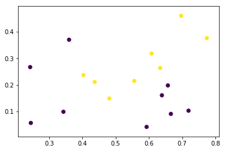
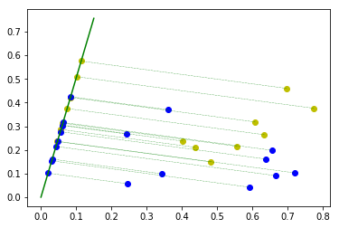
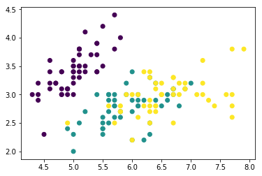
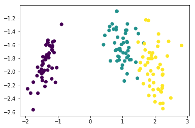

# LDA(线性判别分析)

> 《机器学习》——周志华
> [线性判别分析原理分析](https://www.cnblogs.com/pinard/p/6244265.html)

- 线性判别分析（Linear Discriminant Analysis）是一种经典的线性学习算法。
- 思想：给定训练集，设法将样例投影到一条直线上，使得同类样例的投影点尽可能接近、异类样例的投影点尽可能远离。
- 在对新样本进行分类时，将其投影到同样的这条直线上，再根据投影点的位置来确定新样本的类别。

## 二分类问题

- 给定数据集$D=\{(x_i, y_i)_{i=1}^m, y_i \in \{0,1\}\}$.
- $X_i, \mu_i, \Sigma_i$表示：第$i \in \{ 0, 1\}$类示例的集合、均值向量、协方差矩阵。
- 若将数据投影到直线$w$上，则两类样本的中心在直线上的投影分别为$w^mu_0, w^T\mu_1$。

**优化目标**：

$$\begin{align}
J = & \frac{\| w^T\mu_0 - w^T\mu_1 \|_2^2}{w^T\Sigma_0w + w^T\Sigma_1w} \\

= & \frac{w^T(\mu_0 - \mu_1)(\mu_0 - \mu_1)^Tw}{w^T(\Sigma_0 + \Sigma_1)w}
\end{align}$$

- 上式分子表示：异类投影点之间的距离；分母表示：同类样例投影点之间的距离。
- 定义“类内散度矩阵（**within-class scatter matrix**）”

$$\begin{align}
S_w & = \Sigma_0 + \Sigma_1 \\
& = \sum_{x \in X_0}(x-\mu_0)(x-\mu_0)^T + \sum_{x \in X_1}(x-\mu_1)(x-\mu_1)^T
\end{align}$$

- "类间散度矩阵（**between-class scatter matrix**）"

$$S_b = (\mu_0 - \mu_1)(\mu_0 + \mu_1)^T$$

- 重写目标函数：

$$J = \frac{w^TS_bw}{w^TS_ww}$$

- 上式的解与$w$的长度无关，只与其方向有关，不失一般性，令$w^T S_w w = 1$：

$$\min_w -w^TS_bw \\ s.t. \quad w^TS_ww = 1$$

- 由拉格朗日法，上式等价于：

$$S_bw=\lambda S_w w$$

- 由于$S_b w$的方向恒为$\mu_0 - \mu_1$，令$S_b w = \lambda (\mu_0 - \mu_1)$.带入上式，得到解:

$$w = S_w^{-1}(\mu_0 - \mu_1)$$

## 多分类问题

- 定义“全局散度矩阵”:

$$\begin{align}
S_t &= S_b + S_w\\
&=\sum_{i=1}^m(x_i - \mu)(x_i-\mu)^T
\end{align}$$

**注：** $\mu$是所有样例的均值向量

- 将类内散度矩阵$S_w$重定义为每个类别的散度矩阵之和：

$$S_w = \sum_{i=1}^N S_{w_i} \\
S_{w_i} = \sum_{x \in X_i}(x-\mu_i)(x-\mu_i)^T \\
\begin{align}
S_b &= S_t - S_w \\
&=\sum_{i=1}^N m_i(\mu_i-\mu)(\mu_i-\mu)^T
\end{align}$$

- 常采用的优化目标是：

$$\max_W \frac{tr(W^TS_bW)}{tr(W^TS_wW)}$$

- 上述问题可以通过如下广义特征值问题求解：

$$S_bW=\lambda S_w W$$

- $W$的闭式解则是$S_w^{-1}S_b$的$N-1$个最大广义特征值所对应的特征值向量组成的矩阵。

## 算法流程

1. 计算类内散度矩阵$S_w$
2. 计算类间散度矩阵$S_b$
3. 计算矩阵$S_w^{-1}S_b$
4. 计算上一步得到的矩阵的最大的$k$个特征值和对应的特征向量$(w_1,w_2,\dots,w_k)$，组成投影矩阵
5. 对样本集中的每一个样本转化为新的样本：$z_i=W^T x_i$
6. 得到降维后的样本集$D`=\{(z_1,y_1),(z_2,y_2),\dots,(z_m,y_m)\}$

## 实验部分


> [机器学习算法的Python实现 (1)：logistics回归 与 线性判别分析（LDA）](https://blog.csdn.net/wzmsltw/article/details/51037725)

> [线性判别分析(LDA)和python实现（多分类问题）](https://blog.csdn.net/z962013489/article/details/79918758)


```python
# 导入必要的库
from lda import LDA
import numpy as np
import matplotlib.pyplot as plt
from sklearn.datasets import load_iris

%matplotlib inline
```


```python
# 加载数据集
# 西瓜3.0a
data = np.loadtxt('watermelon.txt', delimiter='\t')
X = data[:, :-1]
y = data[:, -1]

plt.scatter(X[:, 0], X[:, 1], c=y)
```


    <matplotlib.collections.PathCollection at 0x1f7df8acb00>





```python
# 降低维数至1
k = 1

lda = LDA(k)

lda.fit(X, y)

# 获得降维后数据
X_new = lda.reduceDimen(X)
```


```python
# 可视化降维结果
k = lda.w[1] / lda.w[0]
theta = np.arctan(k)
for i in range(len(X)):
    x0, x1 = X[i, 0], X[i, 1]
    y0 = -X_new[i] * np.cos(theta)
    y1 = -X_new[i] * np.sin(theta)
    plt.plot([x0, y0], [x1, y1], '-.', c='g', linewidth=0.3)
    color = ['b', 'y']
    plt.scatter([x0,y0], [x1,y1], c=color[int(y[i])])

plt.plot([0,0.15],[0,0.15*k], 'g')
```


    [<matplotlib.lines.Line2D at 0x1f7dfbdf4a8>]





## 鸢尾花数据集降维


```python
# 加载数据
iris = load_iris()
X = iris.data
y = iris.target

# 可视化
plt.scatter(X[:, 0], X[:, 1], marker='o', c=y)
```


    <matplotlib.collections.PathCollection at 0x16ced44ef60>





```python
# 降低维数至2
k = 2

lda = LDA(k)

lda.fit(X, y)

# 获得降维后数据
X_new = lda.reduceDimen(X)
```


```python
# 可视化降维后数据
plt.scatter(X_new[:, 0], X_new[:, 1], marker='o', c=y)
```


    <matplotlib.collections.PathCollection at 0x16ced4f3be0>




