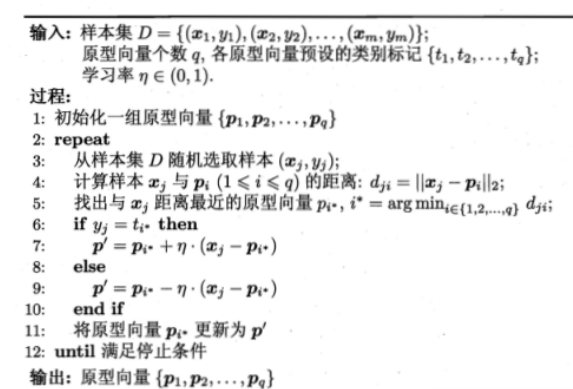
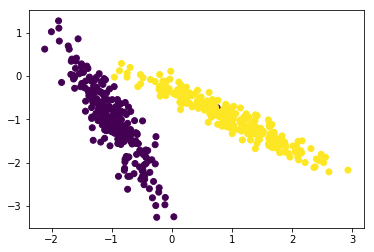

# LVQ

> 机器学习- 周志华

- "学习向量量化"（Learning Vector Quantization）
- 算法目的：学习一组n维原型向量$\{p_1,p_2,\dots,p_q \}$,每个原型向量代表一个聚类簇，簇标记$t_i \in \mathbb y$

## 算法流程



- 上面第一行中先对原型向量进行初始化，例如：对第q个簇可从类标记为$t_q$的样本中随机选取一个作为原型向量。
- 算法的停止条件可以设为迭代次数或是原型向量更新很小。

## 实验部分

```python
# 导入必要的包
from lvq import LVQ
import matplotlib.pyplot as plt
from sklearn.datasets import make_classification
from sklearn.datasets import load_iris
from sklearn.model_selection import train_test_split

%matplotlib inline
```

## 二分类


```python
# 生成数据
X, y = make_classification(n_samples=500, n_features=2, n_informative=2,\
                           n_redundant=0,n_repeated=0, n_classes=2, n_clusters_per_class=1)

# 数据可视化
plt.scatter(X[:, 0], X[:, 1], c=y)
```


    <matplotlib.collections.PathCollection at 0x23b088a4dd8>





```python
# 分割训练集、数据集
x_train,x_test,y_train,y_test = train_test_split(X,y,test_size=0.3,random_state=0)


# 分类器参数

# 学习率
learning_rate = 0.1
# 迭代次数
num_iters = 50
# 实例化分类器
clf = LVQ()
# 训练
clf.fit(x_train, y_train, num_iters, learning_rate)
# 评价准确率
acc = clf.evalute(x_test, y_test)

print("acc : {0}".format(acc))
```

    iter 0/50
    iter 5/50
    iter 10/50
    iter 15/50
    iter 20/50
    iter 25/50
    iter 30/50
    iter 35/50
    iter 40/50
    iter 45/50
    acc : 0.92
    

## iris 数据集测试


```python
# 加载 iris 数据集
iris = load_iris()

X, y = iris.data, iris.target
# 分割训练集、测试集
x_train,x_test,y_train,y_test = train_test_split(X,y,test_size=0.3,random_state=0)
```


```python
# 分类器参数

# 学习率
learning_rate = 0.2
# 迭代次数
num_iters = 100
# 实例化分类器
clf = LVQ()
# 训练
clf.fit(x_train, y_train, num_iters, learning_rate)
# 评价准确率
acc = clf.evalute(x_test, y_test)

print("acc : {0}".format(acc))
```

    iter 0/100
    iter 10/100
    iter 20/100
    iter 30/100
    iter 40/100
    iter 50/100
    iter 60/100
    iter 70/100
    iter 80/100
    iter 90/100
    acc : 0.9333333333333333